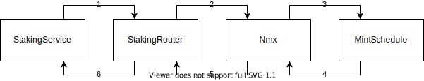

## NMX Contract
The NMX contract is an ERC20 token with a **predefined** mint schedule. Part of the tokens had already been distributed by the exchange in a centralized manner by the time the NMX contract was created. This part is released to the address of the exchange in the constructor.
The mint schedule was determined when the contract was issued and **cannot be changed** in the future.

## Mint Schedule
The schedule is built in such a way that the number of coins minted daily decreases every week. Decrease rate is different at different periods of time. The rates are selected in such a way that no more than **200 million** tokens are minted during the entire NMX mint period (5218 weeks ≈ **100 years**).
Releases NMX are distributed among four distribution pools:
1. Primary pool
2. Nominex pool (Bonus and Team pools included)

Each distribution pool represents an address in the ethereum network tokens will be credited to. The proportions in which distribution pools receive minted NMX change over time but are also **predefined** by the schedule.

### Distribution pools
Nominex pool is address owned by the Nominex exchange. Tokens are simply credited to it. Further distribution of NMX credited to these pool is carried out by the Nominex exchange in a centralized manner and is not of interest within the ethereum network. Distribution within the Primary Pool is discussed below.

## Primary distribution pool
The Primary pool is a set of contracts designed to accrue NMX for staking LP Uniswap tokens. All interaction can be expressed as follows: the contract calls the supplyNMX() ​​method of its NMX supplier, receives an additional amount of tokens and distributes them to its NMX consumers somehow. The NMX suuplier in turn calls a method from its NMX supplier, etc. The contract interaction scheme is presented below:

1. StakingService calls the StakingRouter (its NMX provider) method to get new tokens on each state change (staking or unstaking).
2. StakingRouter calls a method from NMX (its supplier NMX) to get new tokens.
3. NMX sees that the calling contract is the owner of the Primary Pool and asks the schedule to update the distribution state of the Primary Pool.
4. MintSchedule updates the distribution status of the Primary pool and returns the number of tokens that the contract must mint to the address of the Primary pool owner.
5. NMX mints new tokens to the Primary pool owner's address and returns their number as a result of calling the supplyNMX method.
6. StakingRouter gets information about how much NMX has just been added to it. Distributes these NMX between various StakingService according to their shares (in the degenerate case all received NMX tokens are credited to one StakingService) and stores changes in the internal state. Then it returns to the caller (particular StakinService) the number of NMX that have been charged to it since the last call. After that the StakingService updates the internal state based on the number of tokens it has just received so that in the future it will be possible to calculate the reward in NMX for all addresses that took part in staking LP tokens in proportion to their shares and staking periods.

---

Users interact only with the StakingService contract for staking, unstaking and receiving staking rewards. Non-staking transactions available under the ERC20 standard are performed on an NMX contract address.