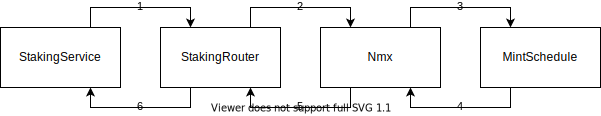

## Контракт Nmx
Контракт Nmx - это ERC20 токен с **предопределенным** расписанием выпуска монет. К моменту создания контракта Nmx часть токенов уже была распределена биржей централизованно. Эта часть в конструкторе контракта выпускается на адрес биржи.
Расписание эмиссии определено при выпуске контракта и **не может быть изменено** в дальнейшем.

## Расписание эмиссии
Расписание выстроено таким образом, что количество ежедневно выпускаемых монет каждую неделю уменьшается. В различные периоды времени коэффициент уменьшения недельного пула отличается. Коэффициенты подобраны таким образом, чтобы за все время эмиссии Nmx (5218 недель ≈ **100 лет**) было выпущено не более **200 млн.** токенов. 
Выпускаемые Nmx распределяются среди четырех пулов распределения:
1. Основной пул
2. Бонусный пул
3. Командный пул
4. Пул Nominex

Каждый пул распределения представляет собой адрес в сети ethereum, на который будут начислены токены. Пропорции, в которых пулы распределения получают выпущенные Nmx, с течением времени изменяются, но также **предопределены** расписанием.

### Пулы распределения
Бонусный, Командный и Nominex пулы - адреса, принадлежащие бирже Nominex. На них токены просто начисляются. Дальнейшее распределение начисленных на эти три пула Nmx осуществляется централизовано биржей Номинекс и не представляет интереса в рамках ethereum сети. Распределение внутри Основного пула рассмотено ниже.

## Основной пул распределения
Основной пул представляет собой набор контрактов, предназначенных для начисления Nmx за стейкинг LP токенов Uniswap. Всё взаимодействие можно выразить следующим образом: контракт вызывает у своего поставщика Nmx метод supplyNmx(), получает дополнительное количество токенов и каким-то образом распределяет их по своим потребителям Nmx. Поставщик Nmx вызывает в свою очередь метод у своего поставщика Nmx и т.д. Схема взаимодействия контрактов представлена ниже:

                                                                                                                           

1. При каждом изменении состояния (staking или unstaking) StakingService вызывает у StakingRouter (своего поставщика Nmx) метод для получения новых токенов.
2. StakingRouter вызывает у Nmx (своего поставщика Nmx) метод для получения новых токенов.
3. Nmx видит, что вызывающий его контракт - владелец Основного пула, и запрашивает у расписания обновление состояния распределения Основного пула.
4. MintSchedule обновляет состояние распределения основного пула и возвращает количество токенов, которые контракт должен выпустить на адрес Основного пула распределения.
5. Nmx начисляет на адрес владельца основного пула новые токены и возвращает их количество в качестве результата вызова метода supplyNmx.
6. StakingRouter получает информацию о том, сколько Nmx ему только что добавили. Распределяет эти Nmx между различными StakingService'ами согласно их долям (в вырожденном случае одному StakingService'у начисляются все полученные Nmx токены) и запоминает во внутреннем состоянии. Далее возвращает вызвавшему StakingService количество Nmx, которые были ему начислены с момента последнего вызова. После этого StakingService на основании количества только что полученных им токенов обновляет внутреннее состояние так, чтобы в будущем было возможно рассчитать вознаграждение в Nmx всем адресам, принимавшим участие в стейкинге LP токенов пропорционально их долям и срокам стейкинга.

## Пул прямых начислений
Для увеличения интереса к токену была введена система дополнительных поощрений по реферальным ссылкам. Каждый приглашенный получает дополнительно 5% Nmx к своим начислениям за стейкинг. Каждый пригласивший получает проценты от доходов его приглашенных. Процент, который получает пригласивший, зависит от количества NMXLP, которые он стейкает лично, выраженного в эквиваленте USDT. Для реферальных начислений выделен отдельный пул токенов Nmx, который по своей сути отличается от остальных пулов, определяемых расписанием: контракт стейкинга получает из него токены по необходимости, пул прямых начислений может закончится раньше 100 лет или наоборот не успеть целиком распределиться к моменту окончания расписания выпуска токенов. Однако суммарное количество всех выпущенных Nmx по-прежнему не превышает 200 млн.

---

Пользователи взаимодействуют только с контрактом StakingService для осуществления стейкинга, анстейкинга и получения вознаграждения за стейкинг. Операции, не связанные со стейкингом и доступные в рамках стандарта ERC20, выполняются на контракте Nmx.